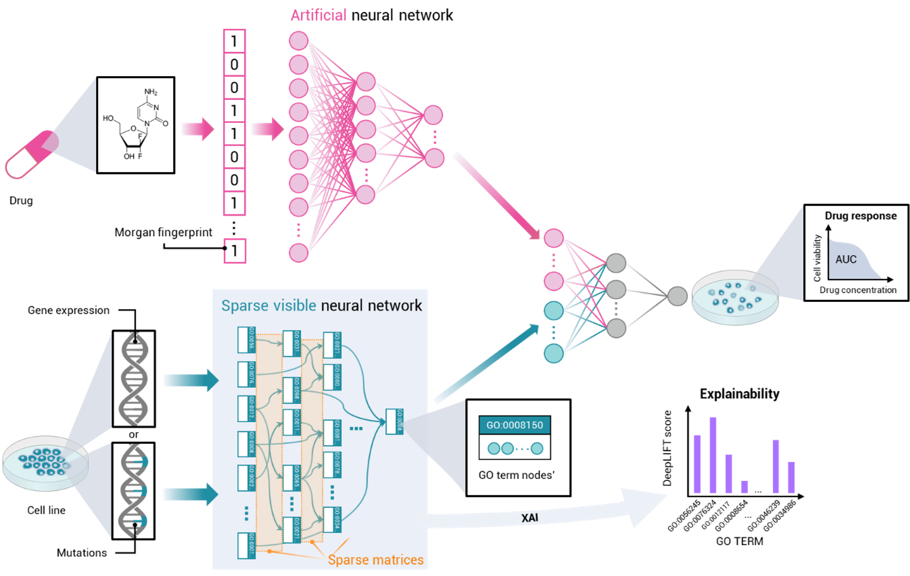

<!-- PROJECT LOGO -->
<br />
<div align="center">
  <a href="https://github.com/KatynaSada/SparseGO_code">
    
  </a>

  <h3 align="center">SparseGO</h3>

  <p align="center">
    A VNN to predict cancer drug response using a sparse explainable neural network
    +
    <br />
    a method to predict the mechanism of action of drugs.
    <br />
    <a href="https://github.com/KatynaSada/SparseGO_code/issues">Request Feature</a>
  </p>
</div>


<!-- TABLE OF CONTENTS -->
<details>
  <summary>Table of Contents</summary>
  <ol>
    <li>
      <a href="#about-the-project">About The Project</a>
      <ul>
        <li><a href="#built-with">Built With</a></li>
      </ul>
    </li>
    <li>
      <a href="#getting-started">Getting Started</a>
      <ul>
        <li><a href="#prerequisites">Prerequisites</a></li>
        <li><a href="#Environment-set-up-for-training-and-testing-of-SparseGO">Environment set up</a></li>
      </ul>
    </li>
    <li>
      <a href="#Training-and-testing-SparseGO">Training and testing SparseGO</a>
      <ul>
        <li><a href="#Required-input-files">Required input files</a></li>
        <li><a href="#Training">Training</a></li>
        <ul>
          <li><a href="#Parameters-for-training">Parameters</a></li>
        </ul>
        <li><a href="#Testing">Testing</a></li>
        <ul>
          <li><a href="#Parameters-for-predicting">Parameters</a></li>
        </ul>
      </ul>
    </li>
    <li><a href="#DeepMoA-method-to-predict-the-MoA-of-drugs-using-DeepLIFT">DeepMoA</a></li>
    <li><a href="#contributing">Contributing</a></li>
    <li><a href="#contact">Contact</a></li>
    <li><a href="#acknowledgments">Acknowledgments</a></li>
  </ol>
</details>


<!-- ABOUT THE PROJECT -->
# About The Project

 <p align="center"></p>


Artificial intelligence (AI), and specifically Deep Neural Networks (DNNs), have been successfully applied to predict drug efficacy in cancer cell lines. However, understanding how the recommendation is carried out, is still a challenge when using DNNs. An algorithm called <a href="https://pubmed.ncbi.nlm.nih.gov/33096023/">DrugCell<a> showed that by simulating the Gene Ontology structure with a DNN, each neuron in the network can be assigned an interpretation. Here we present SparseGO, a sparse explainable neural network that extends this approach in two different ways: first, by optimizing the algorithm using sparse DNNs to accommodate any type of omics data as input, and second, by fusing an eXplainable Artificial Intelligence (XAI) technique with another machine learning algorithm to systematically predict the mechanism of action (MoA) of drugs.  

This project includes instructions for:
* making predictions using a trained SparseGO network,
* training a SparseGO network,
* and using the DeepMoA method to predict the MoA of drugs.

<p align="right">(<a href="#About-The-Project">back to top</a>)</p>


### Built With

*   <a href="https://www.python.org/">
      
    </a>
*   <a href="https://pytorch.org/">
      
    </a>
*   <a href="http://geneontology.org/">
      
    </a>

<p align="right">(<a href="#About-The-Project">back to top</a>)</p>

<!-- GETTING STARTED -->
# Getting Started

```diff
- The original DrugCell repository served as the basis for these instructions. I'd like to take this chance to thank the Trey Ideker Lab at UCSD!
```
* <a href="https://pubmed.ncbi.nlm.nih.gov/33096023/">DrugCell<a>
* <a href="https://github.com/idekerlab">Trey Ideker Lab<a>

## Prerequisites
SparseGO training/testing scripts require the following environmental setup:

* Hardware
    * GPU server with CUDA>=12 installed

* Software
    * Python >=3.8
    * Anaconda
        * Relevant information for installing Anaconda can be found in: https://docs.conda.io/projects/conda/en/latest/user-guide/install/.
    * PyTorch >=1.10 and PyTorch Sparse
        * Depending on the specification of your machine, run appropriate command to install PyTorch.
        The installation command line can be found in https://pytorch.org/get-started/locally/.
        * After installing PyTorch install <a href="https://pypi.org/project/torch-sparse/">PyTorch Sparse<a>, to install the binaries for PyTorch 1.13.0, simply run
        ```angular2
        pip install torch-scatter torch-sparse -f https://data.pyg.org/whl/torch-1.13.0+${CUDA}.html
        ```
        where ```${CUDA}``` should be replaced by either ```cpu```, ```cu116```, or ```cu117``` depending on your PyTorch installation.
    * Weights & Biases · MLOps platform (only for training)

      **1.** Create wandb free account at <a href="https://wandb.ai/site">https://wandb.ai/site<a>

      **2.**  Install the wandb library on your machine in a Python 3 environment
      ```angular2
      pip install wandb
      ```
      **3.** Login to the wandb library on your machine. You will find your API key here: <a href="https://wandb.ai/authorize.">https://wandb.ai/authorize.<a>
      ```angular2
      wandb login APIKEY
      ```
      where ```APIKEY``` should be replaced by your API key.

## Environment set up for training and testing of SparseGO
* Run the following command line inside the environment folder to set up a virtual environment (SparseGO).
  ```angular2
  conda env create -f SparseGO_environment.yml
  ```
* After setting up the conda virtual environment, make sure to activate environment before executing SparseGO scripts.
    When training or testing using the bash scripts provided (_train_wb.sh_ or _test.sh_), there's no need to run this as the example bash scripts already have the command line.
  ```angular2
  source activate SparseGO
  ```
<p align="right">(<a href="#About-The-Project">back to top</a>)</p>

# Training and testing SparseGO
## Required input files
Required input files:
1. Cell feature files:
    * **_gene2ind.txt_**: Gene to ID mapping file
    * **_cell2ind.txt_**: Cell to ID mapping file, a tab-delimited file where the 1st column is index of cells and the 2nd column is the name of cells (genotypes).
      The column index of each gene should match with those in _gene2ind.txt_ file. The line number should
      match with the indices of cells in _cell2ind.txt_ file.

    * **_cell2mutation.txt_** OR **_cell2expression.txt_**: choose the file depending on whether you want to train with mutations or with expression
      * _cell2mutation.txt_: a comma-delimited file where each row has 3,008 binary values indicating each gene is mutated (1) or not (0).
        OR
      * _cell2expression.txt_: a comma-delimited file where each row has 15014 values indicating the expression of 15014 genes.
        * The script to download the expression data and create the file is provided in _extra_ folder (_get_expression_matrix.R_). It requires the _cell2ind.txt_ file.
2. Drug feature files:
    * **_drug2ind.txt_**: a tab-delimited file where the 1st column is index of drug and the 2nd column is
    identification of each drug (e.g., SMILES representation or name). The identification of drugs
    should match to those in _drug2fingerprint.txt_ file.
    * **_drug2fingerprint.txt_**: a comma-delimited file where each row has 2,048 binary values which would form
    , when combined, a Morgan Fingerprint representation of each drug.
    The line number should match with the indices of drugs in _drug2ind.txt_ file.

3. Training data file: **_drugcell_train.txt_**
    * A tab-delimited file containing all data points that you want to use to train the model.
        The 1st column is identification of cells (genotypes), the 2nd column is identification of
        drugs and the 3rd column is an observed drug response in a floating number.

4. Validation data file: **_drugcell_val.txt_**
    * A tab-delimited file that in the same format as the training data.

5. Test data file: **_drugcell_test.txt_**
    * A tab-delimited file containing all data points that you want to estimate drug response for. A tab-delimited file that in the same format as the training data.

6. Ontology (hierarchy) file: **_drugcell_ont.txt_** OR **_sparsego_ont.txt_**
    * A tab-delimited file that contains the ontology (hierarchy) that defines the structure of a branch
          of the model that encodes the genotypes. The first column is always a term (subsystem or pathway) or a gene,
          and the second column is another term or a gene.
          The third column should be set to "default" when the line represents a link between terms, and
          "gene" when the line represents an annotation link between a term and a gene.
          The following is an example describing a sample hierarchy.
          
          ```

           GO:0045834	GO:0045923	default
           GO:0045834	GO:0043552	default
           GO:0045923	AKT2	gene
           GO:0045923	IL1B	gene
           GO:0043552	PIK3R4	gene
           GO:0043552	SRC	gene
           GO:0043552	FLT1	gene
          ```

        * _drugcell_ont.txt_ is the file used to create DrugCell and the SparseGO mutations model.
        * _sparsego_ont.txt_ is the file used to create the SparseGO expression model.
          * The script to create the ontology file is provided in _extra_ folder (_get_gene_hierarchy.py_). It requires the _gene2ind.txt_ and _cell2expression.txt_ files.

<p align="right">(<a href="#About-The-Project">back to top</a>)</p>

## Training

### Parameters for training

There are a few optional parameters that you can provide in addition to the input files:

  1. **-epoch**: the number of epoch to run during the training phase (type=int).

  2. **-lr**: the learning rate (type=float).

  3. **-decay_rate**: the learning decay rate (type=float).

  4. **-batchsize**: the number of training examples in one forward/backward pass. The higher the batch size, the more memory space you'll need (type=int).

  5. **-modeldir**: folder to store trained models (type=str).

  6. **-cuda_id**: GPU ID (type=int).

  7. **-number_neurons_per_GO**: Mapping for the number of neurons in each term in genotype parts (type=int).

  8. **-Mapping for the number of neurons in the root term**: Mapping for the number of neurons in each term in genotype parts (type=int).

  9. **-drug_neurons**: Mapping for the number of neurons in each layer (type=int).

  10. **-final_neurons**: Number of neurons before the output and after concatenating (type=int).

  11. **-result**: folder to store the results of the predictions of test (type=str).

  12. **-project**: wandb project name that you want to use (type=str).

  13. **-gpu_name**: not important, just a reminder of which GPU you used (type=str).

## Testing
sss

### Parameters for predicting

<p align="right">(<a href="#About-The-Project">back to top</a>)</p>

# DeepMoA method to predict the MoA of drugs using DeepLIFT

<!-- CONTRIBUTING -->
# Contributing

Any contributions you make are **greatly appreciated**.

If you have a suggestion that would make this better, please fork the repo and create a pull request. You can also simply open an <a href="https://github.com/KatynaSada/SparseGO_code/issues">issue</a> with the tag "enhancement".
Don't forget to give the project a star! Thanks again!

1. Fork the Project
2. Create your Feature Branch (`git checkout -b feature/AmazingFeature`)
3. Commit your Changes (`git commit -m 'Add some AmazingFeature'`)
4. Push to the Branch (`git push origin feature/AmazingFeature`)
5. Open a Pull Request

<p align="right">(<a href="#About-The-Project">back to top</a>)</p>

<!-- CONTACT -->
# Contact

Katyna Sada - ksada@unav.es - ksada@tecnun.es

<p align="right">(<a href="#About-The-Project">back to top</a>)</p>


<!-- ACKNOWLEDGMENTS -->
# Acknowledgments
* [DrugCell](https://github.com/idekerlab/DrugCell)
* [Weights & Biases](https://www.wandb.ai/)
* [Sparse Linear](https://github.com/hyeon95y/SparseLinear)

<p align="right">(<a href="#About-The-Project">back to top</a>)</p>

<!-- MARKDOWN LINKS & IMAGES -->
