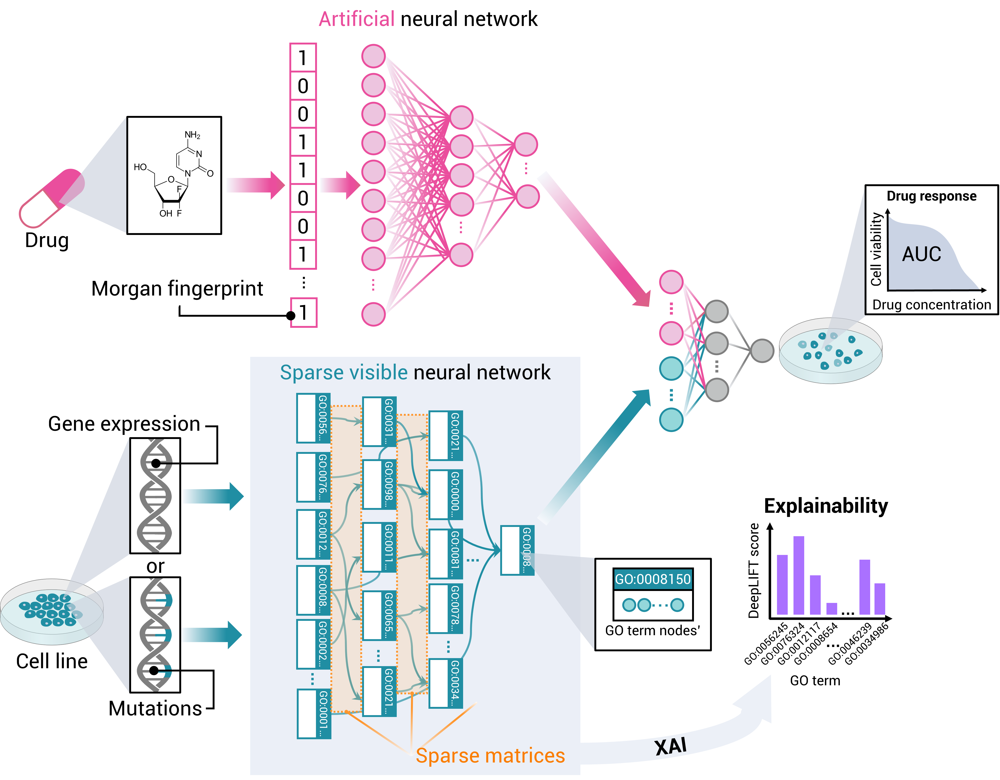

<!-- PROJECT LOGO -->
<br />
<div align="center">
  <a href="https://github.com/KatynaSada/SparseGO_code">
    
  </a>

  <h3 align="center">SparseGO</h3>

  <p align="center">
    A VNN to predict cancer drug response using a sparse explainable neural network
    +
    <br />
    a method to predict the mechanism of action of drugs.
    <br />
    <a href="https://github.com/KatynaSada/SparseGO_code/issues">Request Feature</a>
  </p>
</div>


<!-- TABLE OF CONTENTS -->
<details>
  <summary>Table of Contents</summary>
  <ol>
    <li>
      <a href="#about-the-project">About The Project</a>
      <ul>
        <li><a href="#built-with">Built With</a></li>
      </ul>
    </li>
    <li>
      <a href="#getting-started">Getting Started</a>
      <ul>
        <li><a href="#prerequisites">Prerequisites</a></li>
        <li><a href="#installation">Installation</a></li>
      </ul>
    </li>
    <li><a href="#usage">Usage</a></li>
    <li><a href="#roadmap">Roadmap</a></li>
    <li><a href="#contributing">Contributing</a></li>
    <li><a href="#contact">Contact</a></li>
    <li><a href="#acknowledgments">Acknowledgments</a></li>
  </ol>
</details>


<!-- ABOUT THE PROJECT -->
# About The Project

 <p align="center"></p>


Artificial intelligence (AI), and specifically Deep Neural Networks (DNNs), have been successfully applied to predict drug efficacy in cancer cell lines. However, understanding how the recommendation is carried out, is still a challenge when using DNNs. An algorithm called <a href="https://pubmed.ncbi.nlm.nih.gov/33096023/">DrugCell<a> showed that by simulating the Gene Ontology structure with a DNN, each neuron in the network can be assigned an interpretation. Here we present SparseGO, a sparse explainable neural network that extends this approach in two different ways: first, by optimizing the algorithm using sparse DNNs to accommodate any type of omics data as input, and second, by fusing an eXplainable Artificial Intelligence (XAI) technique with another machine learning algorithm to systematically predict the mechanism of action (MoA) of drugs.  

This project includes instructions for:
* making predictions using a trained SparseGO network,
* training a SparseGO network,
* and using the DeepMoA method to predict the MoA of drugs.

<p align="right">(<a href="#readme-top">back to top</a>)</p>


### Built With

*   <a href="https://www.python.org/">
      
    </a>
*   <a href="https://pytorch.org/">
      
    </a>
*   <a href="http://geneontology.org/">
      
    </a>

<p align="right">(<a href="#readme-top">back to top</a>)</p>

<!-- GETTING STARTED -->
# Getting Started

```diff
- The original DrugCell repository served as the basis for these instructions. I'd like to take this chance to thank the Trey Ideker Lab at UCSD!
```
* <a href="https://pubmed.ncbi.nlm.nih.gov/33096023/">DrugCell<a>
* <a href="https://github.com/idekerlab">Trey Ideker Lab<a>

## Prerequisites

# Environment set up for training and testing of SparseGO
SparseGO training/testing scripts require the following environmental setup:

* Hardware required for training a new model
    * GPU server with CUDA>=12 installed

* Software
    * Python >=3.8
    * Anaconda
        * Relevant information for installing Anaconda can be found in: https://docs.conda.io/projects/conda/en/latest/user-guide/install/.
    * PyTorch >=1.10 and PyTorch Sparse
        * Depending on the specification of your machine, run appropriate command to install PyTorch.
        The installation command line can be found in https://pytorch.org/get-started/locally/.
        * After installing PyTorch install <a href="https://pypi.org/project/torch-sparse/">PyTorch Sparse<a>, to install the binaries for PyTorch 1.13.0, simply run
        ```angular2
        pip install torch-scatter torch-sparse -f https://data.pyg.org/whl/torch-1.13.0+${CUDA}.html
        ```
        where ```${CUDA}``` should be replaced by either ```cpu```, ```cu116```, or ```cu117``` depending on your PyTorch installation.

* Set up a virtual environment
    * If you are testing the pre-trained model using a CPU machine, run the following command line to set up an
    appropriate virtual environment (pytorch3drugcellcpu) using the .yml files in _environment_setup_.
        * MAC OS X
        ```angular2
        conda env create -f environment_cpu_mac.yml
        ```
        * LINUX
        ```angular2
        conda env create -f environment_cpu_linux.yml
        ```
    * If you are training a new model or test the pre-trained model using a GPU server, run the following command line
    to set up a virtual environment (pytorch3drugcell).
        ```angular2
         conda env create -f environment.yml
        ```
    * After setting up the conda virtual environment, make sure to activate environment before executing DrugCell scripts.
    When testing in _sample_ directory, no need to run this as the example bash scripts already have the command line.
        ```
        source activate pytorch3drugcell (or pytorch3drugcellcpu)
        ```

### Installation

_Below is an example of how you can instruct your audience on installing and setting up your app. This template doesn't rely on any external dependencies or services._

1. Get a free API Key at [https://example.com](https://example.com)
2. Clone the repo
   ```sh
   git clone https://github.com/your_username_/Project-Name.git
   ```
3. Install NPM packages
   ```sh
   npm install
   ```
4. Enter your API in `config.js`
   ```js
   const API_KEY = 'ENTER YOUR API';
   ```

<p align="right">(<a href="#readme-top">back to top</a>)</p>


<!-- USAGE EXAMPLES -->
## Usage

Use this space to show useful examples of how a project can be used. Additional screenshots, code examples and demos work well in this space. You may also link to more resources.

_For more examples, please refer to the [Documentation](https://example.com)_

<p align="right">(<a href="#readme-top">back to top</a>)</p>


<!-- ROADMAP -->
## Roadmap

- [x] Add Changelog
- [x] Add back to top links
- [ ] Add Additional Templates w/ Examples
- [ ] Add "components" document to easily copy & paste sections of the readme
- [ ] Multi-language Support
    - [ ] Chinese
    - [ ] Spanish

See the [open issues](https://github.com/othneildrew/Best-README-Template/issues) for a full list of proposed features (and known issues).

<p align="right">(<a href="#readme-top">back to top</a>)</p>


<!-- CONTRIBUTING -->
## Contributing

Any contributions you make are **greatly appreciated**.

If you have a suggestion that would make this better, please fork the repo and create a pull request. You can also simply open an <a href="https://github.com/KatynaSada/SparseGO_code/issues">issue</a> with the tag "enhancement".
Don't forget to give the project a star! Thanks again!

1. Fork the Project
2. Create your Feature Branch (`git checkout -b feature/AmazingFeature`)
3. Commit your Changes (`git commit -m 'Add some AmazingFeature'`)
4. Push to the Branch (`git push origin feature/AmazingFeature`)
5. Open a Pull Request

<p align="right">(<a href="#readme-top">back to top</a>)</p>

<!-- CONTACT -->
## Contact

Katyna Sada - ksada@unav.es - ksada@tecnun.es

<p align="right">(<a href="#readme-top">back to top</a>)</p>


<!-- ACKNOWLEDGMENTS -->
## Acknowledgments
* [DrugCell](https://github.com/idekerlab/DrugCell)
* [Weights & Biases](https://www.wandb.ai/)
* [Sparse Linear](https://github.com/hyeon95y/SparseLinear)

<p align="right">(<a href="#readme-top">back to top</a>)</p>

<!-- MARKDOWN LINKS & IMAGES -->
